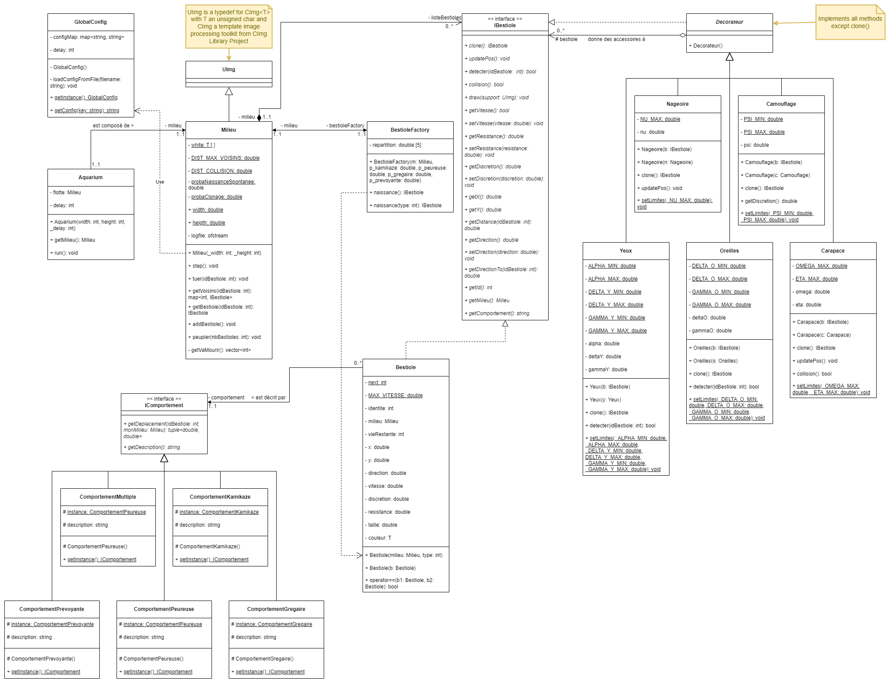
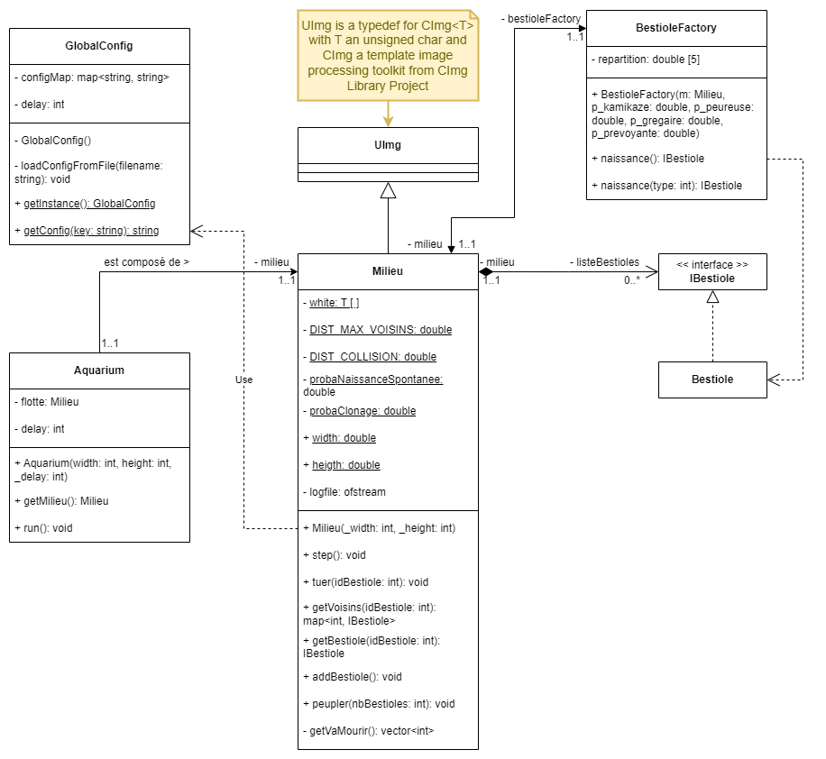
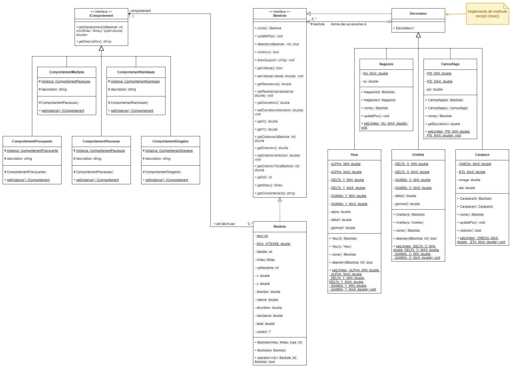
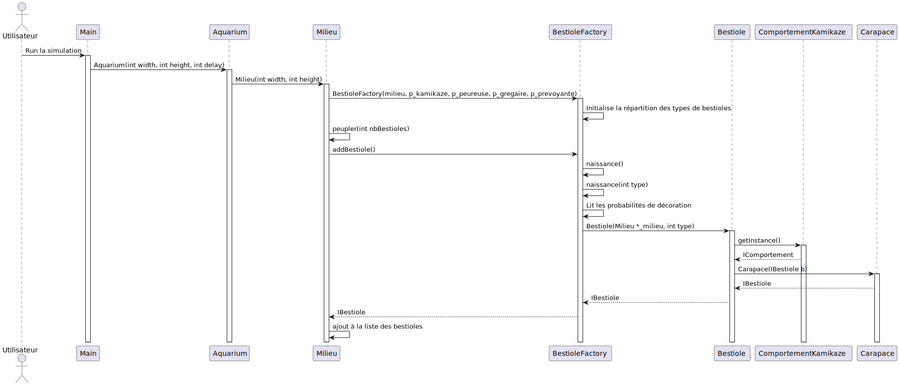
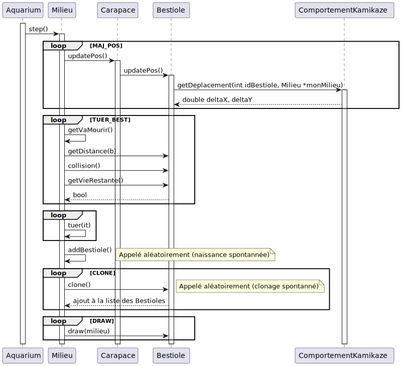

# Rapport de Conception

Ce document de conception est dérivé des exigences du projet, spécifiées dans le document [./assignment.pdf](./assignment.pdf).

## Table des matières
- [Diagramme de cas d'utilisation](#diagramme-de-cas-dutilisation)
- [Diagramme de classes](#diagramme-de-classes)
- [Diagramme de séquence](#diagramme-de-séquence)

## Diagramme de cas d'utilisation

Le diagramme de cas d'utilisation illustre les différentes interactions,
entre les utilisateurs et le système de simulation de l'écosystème aquatique,
permettant ainsi de configurer, modifier et observer l'écosystème pour en comprendre le fonctionnement.

### Configurer :

Les utilisateurs peuvent configurer l'écosystème en définissant les paramètres initiaux, 
tels que le nombre et les comportements des bestioles, 
ainsi que les accessoires et capteurs disponibles. 
Cela correspond à la création de la population initiale de bestioles avec des comportements spécifiques, 
ainsi qu'à la configuration des accessoires et des capteurs.

### Modifier :

Les utilisateurs ont la possibilité de modifier l'écosystème en ajustant les paramètres existants. 
Cela inclut la possibilité de faire naître de nouvelles bestioles, 
de modifier les comportements existants et de tuer des bestioles. 
Cela correspond à la gestion dynamique de la population de bestioles, 
et de leurs comportements au cours de la simulation.

### Observer :

Les utilisateurs peuvent observer l'écosystème et ses composants. 
Cela inclut la possibilité de différencier les comportements des bestioles, 
de voir les accessoires et les capteurs associés à chaque bestiole, 
ainsi que d'accéder à l'état actuel de la population. 
Cela permet aux utilisateurs de surveiller l'évolution de l'écosystème, 
et de prendre des décisions en fonction des informations disponibles.

## Diagramme de classes

Le diagramme de classe a été réalisé pour suivre au mieux les bonnes pratiques de Génie Logiciel SOLID, 
impliquant l'utilisation de Design patterns spécifiques, dont le choix est spécifié ci-dessous 
[Choix des Design Patterns](#choix-des-design-patterns).  

Le langage d'implémentation étant C++, les objets passés en paramètres de méthodes ou retournés,
sont des références ou des smart pointers de la librairie STL. 
Seule la collection de bestioles, map avec l'id et une référence vers la bestiole, 
est un unique_ptr car l'ensemble des bestioles est une propriété exclusive du milieu.
Pour les bestioles, le shared_ptr est à l'inverse privilégié, 
afin de permettre une gestion simplifié de leur cycle de vie malgré un référencement multiple dans différentes classes.
Les destructeurs des classes "systèmes", de la bestiole, et de ses accessoires et capteurs sont implémentés,
bien que cela ne soit pas précisé dans le diagramme.

### Environnement d'Exécution

#### GlobalConfig

Contient un ensemble de configurations différentes pour le fonctionnement de l'application dans différents contextes.

#### Aquarium

Centralise la simulation en maintenant les bestioles et en coordonnant les interactions au cours du temps, 
conformément aux spécifications qui détaillent que l'aquarium doit orchestrer la simulation.

#### Milieu

Contient les bestioles et gère leurs mouvements, ainsi que le milieu spécifié dans la simulation de l'écosystème.

### Modélisation de la Bestiole

#### IBestiole et Bestiole
Classes de base pour les bestioles, possédant les attributs et les méthodes de base pour se déplacer et interagir.

#### Yeux, Oreilles, Nageoire, Carapace et Camouflage
Modifient les caractéristiques de base des bestioles en lien avec les spécifications.

#### Comportements

Modifient la manière des bestioles de se déplacer par rapport à la présence d'autres bestioles.

### Choix des Design Patterns

#### Singleton
- **GlobalConfig** : Permet d'assurer qu'il n'y ait qu'une seule instance de la configuration globale utilisée,
  permettant de maintenir la cohérence des configurations à travers l'ensemble du système de simulation.

#### Factory (Modifié)
- **BestioleFactory** : Utilisée pour centraliser et uniformiser la création des bestioles, 
  bien que cela ne suive pas strictement le modèle de Factory pattern traditionnel.

#### Decorator
- **Decorateur** : Permet d'attacher des responsabilités supplémentaires aux bestioles de manière dynamique, 
  tout en permettant de respecter le principe d'ouverture / fermeture (SOLID).

#### Strategy
- **Comportement** : Les classes telles que `ComportementGregaire`, `ComportementKamikaze`, etc., 
  implémentent le pattern Strategy, permettant aux bestioles de changer leur comportement dynamiquement.

## Diagramme de séquence

Pour expliquer le déroulement des actions dans l'application, 2 diagrammes de séquences sont fournis

### Peuplement
Le diagramme ci-dessous illustre la phase de peuplement de l'écosystème avec des bestioles

### Etapes
Le diagramme ci-dessous illustre les différentes étapes de la simulation de l'écosystème

